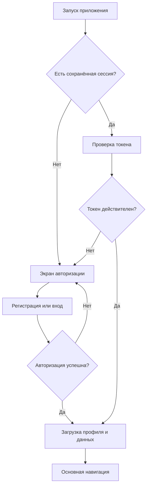
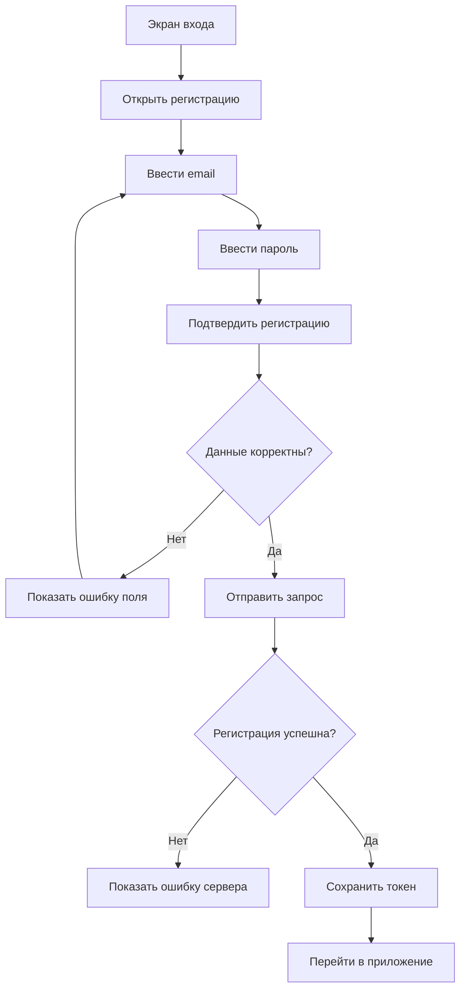
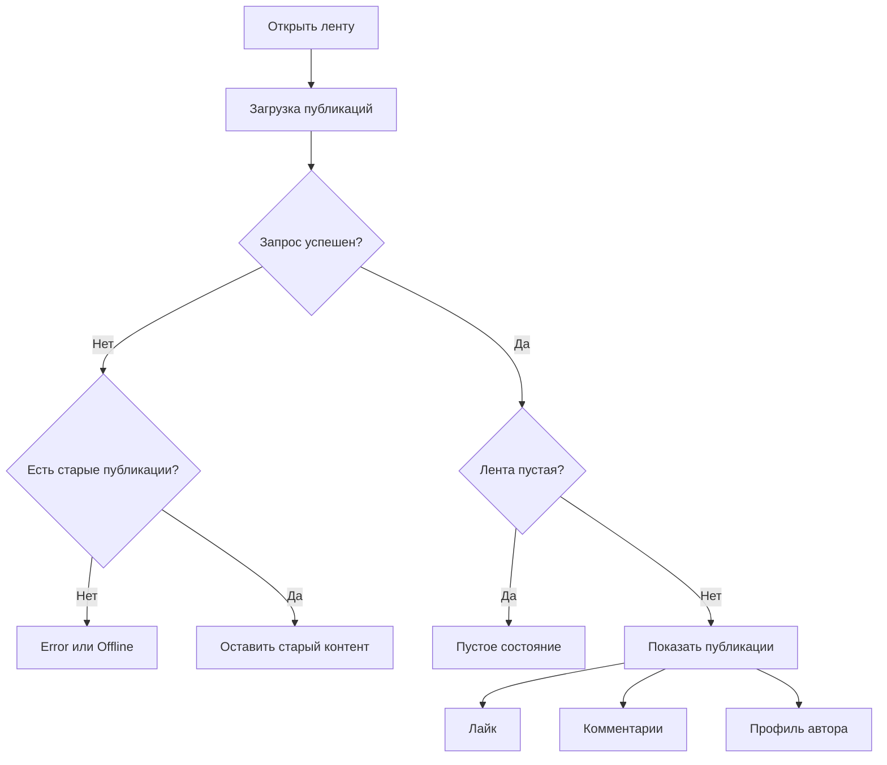
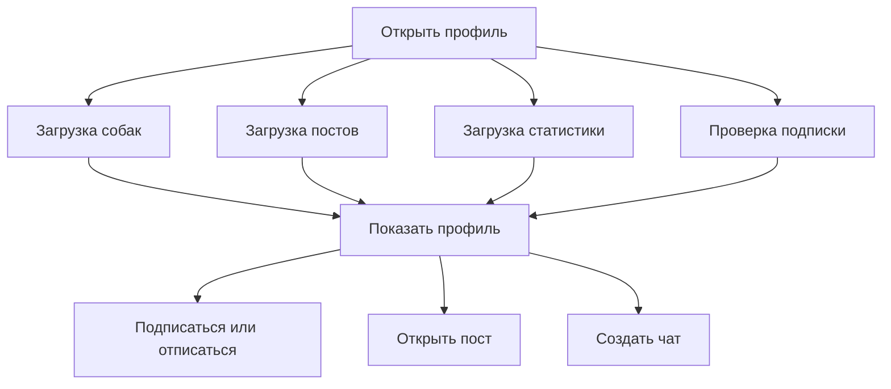
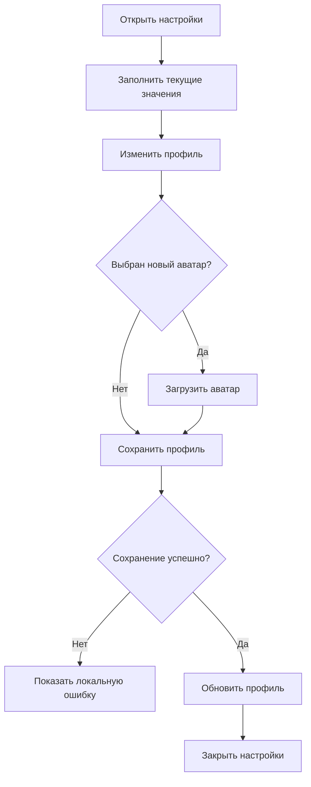
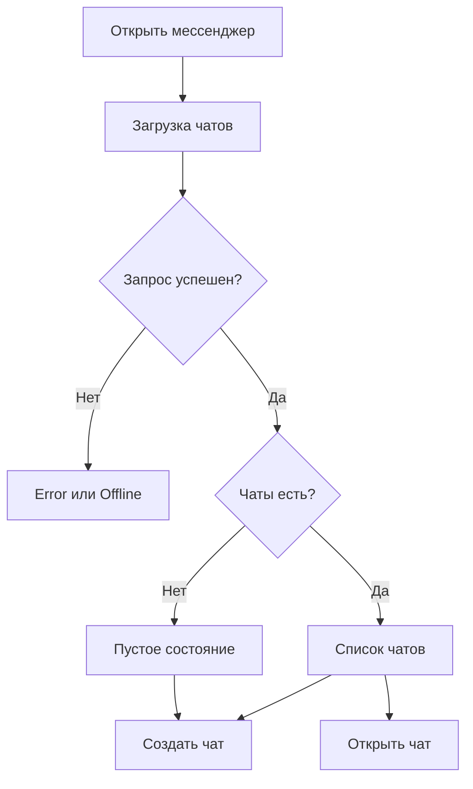
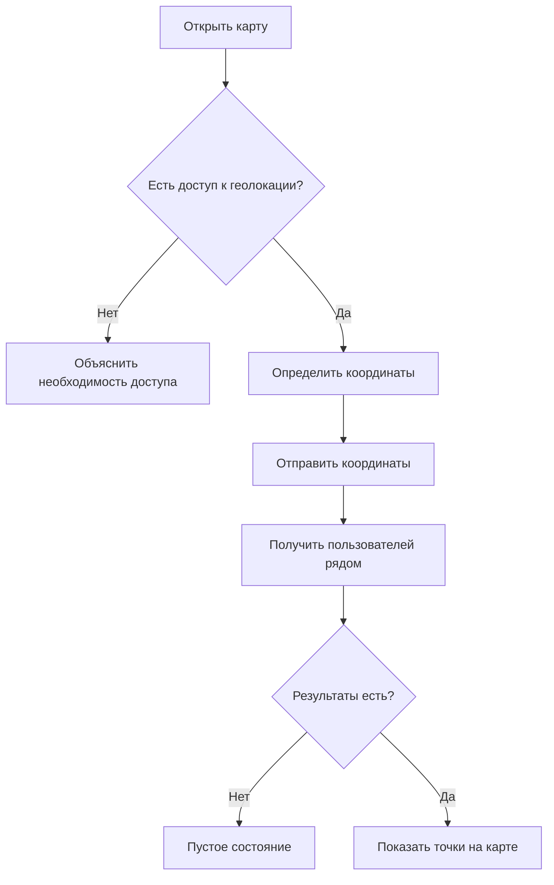

# UX-карта основных сценариев GAV

## 1. Назначение документа

Документ описывает основные пользовательские сценарии социальной сети для владельцев собак GAV.

Для каждого сценария определены:

- точка входа
- основной путь пользователя
- успешный результат
- состояния загрузки
- ошибки
- отсутствие интернета
- пустые состояния
- возможные точки улучшения

---

# 2. Основная навигация

После авторизации пользователь попадает в основную часть приложения.

Основные разделы:

```text
Приложение
├── Лента
├── Поиск
├── Карта
├── Мессенджер
└── Профиль
    ├── Собаки
    ├── Посты
    ├── Прививки
    └── Настройки
```

Основной поток:



---

# 3. Запуск приложения

## Цель пользователя

Открыть приложение и продолжить работу с существующей сессией либо войти в аккаунт.

## Основной сценарий

1. Пользователь запускает приложение.
2. Приложение читает сохранённый access token.
3. Если токен найден, приложение загружает профиль пользователя.
4. Параллельно загружаются основные данные:
   - профиль
   - собаки
   - посты
   - лента
   - чаты
5. Пользователь попадает в основную навигацию.

## Состояния

### Loading

Отображается единый экран:

```text
Загружаем профиль...
```

### Успех

Открывается основная часть приложения.

### Токен отсутствует

Открывается экран входа.

### Токен недействителен

Сессия очищается, открывается экран входа.

### Offline

Отображается:

```text
Нет подключения

Проверьте интернет-соединение и попробуйте ещё раз

[Попробовать снова]
```

## UX-риск

Ошибка загрузки необязательных данных, например чатов, не должна блокировать вход во всё приложение.

---

# 4. Регистрация

## Цель пользователя

Создать новый аккаунт.

## Основной сценарий



## Проверки

- email не пустой
- email имеет корректный формат
- пароль соответствует минимальным требованиям
- поля не содержат только пробелы
- кнопка регистрации недоступна во время запроса

## Ошибки

### Email уже используется

```text
Аккаунт с таким email уже существует
```

### Некорректные данные

```text
Проверьте введённые данные
```

### Ошибка сервера

```text
Сервер временно недоступен
```

### Offline

Используется единое offline-состояние.

---

# 5. Вход

## Цель пользователя

Войти в существующий аккаунт.

## Основной сценарий

1. Пользователь вводит email.
2. Пользователь вводит пароль.
3. Нажимает кнопку входа.
4. Приложение отправляет данные в social network API.
5. Полученный токен сохраняется.
6. Загружается профиль пользователя.
7. Открывается основная часть приложения.

## Ошибки

### Неверные данные

```text
Неверный email или пароль
```

### Offline

Показывается единое offline-состояние.

### Повторное нажатие

На время запроса кнопка блокируется.

---

# 6. Просмотр ленты

## Цель пользователя

Просматривать новые публикации других пользователей.

## Основной сценарий



## Loading

```text
Загружаем ленту...
```

## Пустое состояние

```text
Лента пока пустая

Когда появятся посты, они будут здесь
```

## Обновление

Пользователь делает pull-to-refresh.

Если старые публикации уже отображаются, ошибка обновления не должна скрывать их.

## Лайк

1. Пользователь нажимает кнопку лайка.
2. Интерфейс обновляет состояние.
3. Выполняется API-запрос.
4. При ошибке состояние должно быть возвращено либо показана локальная ошибка.

## Комментарии

1. Пользователь открывает комментарии.
2. Открывается `CommentsView`.
3. Загружается список комментариев.
4. Пользователь может написать новый комментарий.
5. Счётчик комментариев обновляется.

---

# 7. Поиск аккаунтов

## Цель пользователя

Найти другого владельца собаки.

## Основной сценарий

1. Пользователь открывает поиск.
2. Вводит имя либо никнейм.
3. После двух символов начинается поиск.
4. Перед запросом используется задержка 300 мс.
5. Предыдущий незавершённый запрос отменяется.
6. Отображаются найденные профили.
7. Пользователь открывает нужный профиль.

## Состояния

### Пустой запрос

```text
Найди аккаунт

Начни вводить имя или никнейм
```

### Один символ

```text
Продолжай ввод

Введите минимум два символа
```

### Loading

```text
Ищем аккаунты...
```

### Ничего не найдено

```text
Ничего не найдено

Попробуй другой никнейм
```

### Error или Offline

Используется единый `AppStatusView`.

---

# 8. Просмотр чужого профиля

## Цель пользователя

Посмотреть профиль, собак и публикации другого пользователя.

## Основной сценарий



## Loading

```text
Загружаем профиль...
```

## Частичный успех

Если профиль и публикации загрузились, но статистика недоступна, профиль всё равно показывается.

## Пустые состояния

### Нет собак

```text
Собак пока нет
```

### Нет постов

```text
Постов пока нет
```

## Действия

- подписаться
- отписаться
- открыть публикацию
- открыть комментарии
- начать личный чат

Ошибки этих действий показываются локально и не скрывают профиль.

---

# 9. Собственный профиль

## Цель пользователя

Посмотреть и изменить собственные данные.

## Основной сценарий

1. Пользователь открывает профиль.
2. Видит:
   - имя
   - никнейм
   - описание
   - аватар
   - статистику
   - собак
   - публикации
3. Может открыть настройки.
4. Может добавить или изменить собаку.
5. Может открыть раздел прививок.

## Пустые состояния

- собак пока нет
- публикаций пока нет
- прививки пока не добавлены

---

# 10. Настройки профиля

## Цель пользователя

Изменить имя, фамилию, никнейм, описание, аватар и настройки приватности.

## Основной сценарий



## Loading

```text
Загружаем настройки...
```

## Ошибка выбора изображения

Показывается локально внутри формы.

## Ошибка сохранения

Форма и введённые значения остаются на экране.

## Требования

- не закрывать экран при ошибке
- не очищать введённые данные
- блокировать повторное сохранение во время запроса
- показывать индикатор внутри кнопки

---

# 11. Создание публикации

## Цель пользователя

Опубликовать текст или фотографию.

## Основной сценарий

1. Пользователь открывает создание публикации.
2. Вводит текст.
3. При необходимости выбирает изображение.
4. Нажимает кнопку публикации.
5. Если есть изображение, оно сначала загружается.
6. Создаётся публикация.
7. Новая публикация появляется в профиле и ленте.

## Ошибки

### Не удалось загрузить изображение

Текст публикации не очищается.

### Не удалось создать публикацию

Пользователь может повторить запрос.

### Offline

Показывается единое offline-состояние либо локальная ошибка формы.

---

# 12. Комментарии

## Цель пользователя

Прочитать комментарии и добавить собственный.

## Основной сценарий

1. Пользователь открывает комментарии публикации.
2. Загружается список.
3. Пользователь вводит текст.
4. Нажимает кнопку отправки.
5. Новый комментарий появляется в списке.
6. Счётчик комментариев обновляется.

## Loading

```text
Загружаем комментарии...
```

## Пустое состояние

```text
Комментариев пока нет

Стань первым в обсуждении
```

## Ошибка первой загрузки

Используется полный `AppStatusView`.

## Ошибка отправки

Показывается локально над полем ввода.

Список комментариев не скрывается.

---

# 13. Список чатов

## Цель пользователя

Открыть существующий диалог либо создать новый.

## Основной сценарий



## Loading

```text
Загружаем чаты...
```

## Пустое состояние

```text
Чатов пока нет

Когда появится диалог, он будет здесь

[Добавить чат]
```

## Безопасность

Каждый запрос messenger API должен содержать:

```text
Authorization: Bearer <access_token>
```

Пользователь не должен иметь возможность:

- получить список чужих чатов
- отправить сообщение от имени другого пользователя
- отметить сообщение прочитанным от имени другого пользователя

---

# 14. Личный чат

## Цель пользователя

Читать и отправлять сообщения.

## Основной сценарий

1. Пользователь открывает чат.
2. Загружаются последние сообщения.
3. Список прокручивается к последнему сообщению.
4. Пользователь вводит текст.
5. Нажимает отправить.
6. Сообщение появляется в списке.
7. Фоновое обновление получает новые сообщения.

## Loading

```text
Загружаем сообщения...
```

## Пустое состояние

```text
Сообщений пока нет

Отправьте первое сообщение
```

## Ошибка первой загрузки

Показывается полный `AppStatusView`.

## Ошибка polling

Уже загруженные сообщения остаются на экране.

## Ошибка отправки

Показывается локально над полем ввода.

## Вложения

Пользователь может отправить:

- изображение
- файл
- аудиозапись

## UX-риски

- локальные файлы из временной директории могут быть недоступны backend
- polling каждые две секунды создаёт дополнительную нагрузку
- нужен WebSocket для production-версии
- нужна индикация отправки сообщения
- нужна обработка повторной отправки

---

# 15. Карта прогулок

## Цель пользователя

Найти владельцев собак и прогулки рядом.

## Основной сценарий



## Состояние ожидания геолокации

```text
Ждём геолокацию
```

## Loading

```text
Ищем прогулки рядом...
```

## Ошибка разрешения

Не должна отображаться как ошибка интернета.

Пользователю нужно объяснить, как включить геолокацию в настройках системы.

## Ошибка обновления

Если точки уже отображаются, карта остаётся видимой, а ошибка показывается локально.

---

# 16. Собаки пользователя

## Цель пользователя

Добавлять и редактировать данные своих собак.

## Основной сценарий

1. Пользователь открывает профиль.
2. Открывает список собак.
3. Нажимает добавление.
4. Заполняет:
   - имя
   - породу
   - возраст или дату рождения
   - пол
   - описание
   - фотографию
5. Сохраняет собаку.
6. Собака появляется в профиле.

## Ошибки

- некорректные обязательные поля
- ошибка загрузки изображения
- ошибка сохранения
- offline

При ошибке форма не очищается.

---

# 17. Прививки

## Цель пользователя

Хранить сведения о прививках собаки.

## Основной сценарий

1. Пользователь открывает собаку.
2. Открывает раздел прививок.
3. Видит список существующих прививок.
4. Может добавить новую запись.
5. Может изменить или удалить запись.

## Данные прививки

- название
- дата проведения
- следующая дата
- ветеринарная клиника
- комментарий

## Пустое состояние

```text
Прививки пока не добавлены
```

## UX-риск

Перед полноценным использованием нужно исправить update endpoint: клиент должен знать одновременно `dogID` и `vaccinationID`.

---

# 18. Logout

## Цель пользователя

Безопасно выйти из аккаунта.

## Основной сценарий

1. Пользователь нажимает выход.
2. Приложение отправляет logout-запрос.
3. Локальные токены удаляются независимо от результата запроса.
4. Персональные данные очищаются из `AppViewModel`.
5. Открывается экран входа.

## Требования

После выхода не должны оставаться:

- профиль предыдущего пользователя
- его собаки
- публикации
- чаты
- сообщения
- preview-данные
- сохранённый access token

---

# 19. Единая модель состояний

Все экраны, загружающие данные, должны использовать:

```swift
enum AppScreenState {
    case content
    case loading(message: String)
    case error(message: String)
    case offline
}
```

## Правила использования

### Loading

Используется только тогда, когда на экране ещё нет контента.

### Error

Используется при ошибке первой загрузки.

### Offline

Используется при сетевой ошибке, связанной с отсутствием подключения.

### Локальная ошибка

Если контент уже загружен, он не скрывается.

Ошибка отображается внутри текущего экрана.

### Пустое состояние

Пустой успешный ответ не является ошибкой.

Примеры:

```text
Нет публикаций
Нет комментариев
Нет сообщений
Нет чатов
Нет собак
```

---

# 20. Матрица основных сценариев

| Сценарий | Loading | Empty | Error | Offline | Retry |
|---|---:|---:|---:|---:|---:|
| Запуск приложения | Да | Нет | Да | Да | Да |
| Вход | Да | Нет | Да | Да | Да |
| Регистрация | Да | Нет | Да | Да | Да |
| Лента | Да | Да | Да | Да | Да |
| Поиск | Да | Да | Да | Да | Да |
| Чаты | Да | Да | Да | Да | Да |
| Сообщения | Да | Да | Да | Да | Да |
| Комментарии | Да | Да | Да | Да | Да |
| Карта | Да | Да | Да | Да | Да |
| Чужой профиль | Да | Да | Да | Да | Да |
| Настройки | Да | Нет | Да | Да | Да |
| Собаки | Да | Да | Да | Да | Да |
| Прививки | Да | Да | Да | Да | Да |

---

# 21. Найденные UX-проблемы

## Высокий приоритет

1. Messenger должен полностью проверять JWT.
2. Нельзя доверять `sender_id` и `user_id` из request body.
3. Ошибки первой загрузки не должны превращаться в пустой экран.
4. После logout необходимо очищать все пользовательские данные.
5. Preview-данные не должны попадать в runtime.
6. Необходимо исправить update прививки.
7. Локальный путь к вложению нельзя использовать как публичный URL.
8. Ошибка загрузки одного вторичного блока не должна скрывать весь профиль.

## Средний приоритет

1. Добавить WebSocket вместо постоянного polling сообщений.
2. Добавить индикатор отправки сообщений.
3. Добавить повторную отправку неуспешного сообщения.
4. Показывать время последнего успешного обновления.
5. Добавить skeleton placeholders для ленты и профиля.
6. Добавить подтверждение удаления собаки, публикации и прививки.
7. Добавить понятный экран запроса доступа к геолокации.

## Низкий приоритет

1. Анимации появления публикаций и сообщений.
2. Улучшение переходов между профилями.
3. Кэширование изображений.
4. Отдельный дизайн для больших экранов iPad.
5. Поддержка динамического размера шрифта.

---

# 22. Чек-лист ручного UX-тестирования

## Авторизация

- [ ] Новый пользователь может зарегистрироваться
- [ ] Существующий пользователь может войти
- [ ] Неверный пароль показывает понятную ошибку
- [ ] Offline показывает единый экран
- [ ] После перезапуска сохранённая сессия восстанавливается
- [ ] После logout предыдущие данные не видны

## Лента

- [ ] Отображается loading
- [ ] Отображается пустое состояние
- [ ] Pull-to-refresh обновляет данные
- [ ] Ошибка refresh не скрывает старые публикации
- [ ] Лайк обновляется
- [ ] Комментарии открываются
- [ ] Новый комментарий обновляет счётчик

## Профиль

- [ ] Чужой профиль загружается
- [ ] Пустой список собак отображается корректно
- [ ] Пустой список постов отображается корректно
- [ ] Подписка работает
- [ ] Создание чата работает
- [ ] Ошибка действия не скрывает профиль

## Мессенджер

- [ ] Запрос без токена получает 401
- [ ] Запрос с неверным токеном получает 401
- [ ] Нельзя получить список чатов другого пользователя
- [ ] Нельзя отправить сообщение с чужим `sender_id`
- [ ] Пустой чат отображается корректно
- [ ] Ошибка polling не скрывает сообщения
- [ ] Ошибка отправки отображается локально

## Карта

- [ ] Запрашивается разрешение на геолокацию
- [ ] Отказ не отображается как offline
- [ ] При успешной геолокации карта центрируется
- [ ] Точки рядом загружаются
- [ ] Ошибка refresh не скрывает старые точки

## Настройки

- [ ] Текущие значения заполняются
- [ ] Аватар можно выбрать
- [ ] Ошибка аватара не очищает форму
- [ ] Сохранение блокирует повторное нажатие
- [ ] Ошибка сохранения не закрывает экран

---

# 23. Критерий завершённости UX-сценария

Сценарий считается завершённым, если:

1. Пользователь понимает текущее состояние интерфейса.
2. При загрузке отображается явный индикатор.
3. Пустой результат не выглядит как ошибка.
4. Ошибка содержит понятное описание.
5. При отсутствии интернета показывается отдельное offline-состояние.
6. Пользователь может повторить запрос.
7. Уже загруженный контент не исчезает при ошибке обновления.
8. Повторное нажатие не создаёт дублирующие запросы.
9. После успешного действия интерфейс сразу обновляется.
10. Ошибка одного вторичного блока не блокирует весь экран.
